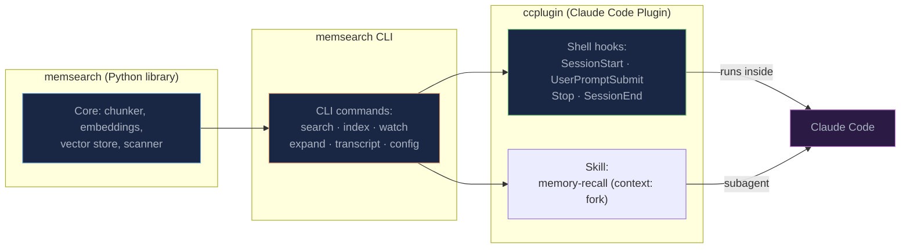

# Claude Code Plugin

**Automatic persistent memory for [Claude Code](https://docs.anthropic.com/en/docs/claude-code).** No commands to learn, no manual saving -- just install the plugin and Claude remembers what you worked on across sessions.

The plugin is built entirely on Claude Code's own primitives: **[Hooks](https://docs.anthropic.com/en/docs/claude-code/hooks)** for lifecycle events, **[Skills](https://docs.anthropic.com/en/docs/claude-code/skills)** for intelligent retrieval, and **[CLI](../cli.md)** for tool access. No [MCP](https://modelcontextprotocol.io/) servers, no sidecar services, no extra network round-trips. Everything runs locally as shell scripts, a skill definition, and a Python CLI.

### How the pieces fit together



The **memsearch Python library** provides the core engine (chunking, embedding, vector storage, search). The **memsearch CLI** wraps the library into shell-friendly commands. The **Claude Code Plugin** ties those CLI commands to Claude Code's hook lifecycle and skill system — hooks handle session management and memory capture, while the **memory-recall skill** handles intelligent retrieval in a forked subagent context.

---

## Without vs. With the Plugin

```mermaid
sequenceDiagram
    participant You
    participant Claude as Claude Code

    rect rgb(60, 30, 30)
    note right of You: Without plugin
    You->>Claude: Monday: "Add Redis caching with 5min TTL"
    Claude->>You: ✅ Done — implements caching
    note over Claude: Session ends. Context is gone.
    You->>Claude: Wednesday: "The /orders endpoint is slow"
    Claude->>You: ❌ Suggests solutions from scratch<br/>(forgot about the Redis cache from Monday)
    end

    rect rgb(20, 50, 30)
    note right of You: With plugin
    You->>Claude: Monday: "Add Redis caching with 5min TTL"
    Claude->>You: ✅ Done — implements caching
    note over Claude: Plugin auto-summarizes → memory/2026-02-10.md
    You->>Claude: Wednesday: "The /orders endpoint is slow"
    note over Claude: Plugin injects: "Added Redis caching<br/>middleware with 5min TTL..."
    Claude->>You: ✅ "We already have Redis caching —<br/>let me add the /orders endpoint to it"
    end
```



---

## When Is This Useful?

- **Picking up where you left off.** You debugged an auth issue yesterday but didn't finish. Today Claude remembers the root cause, which files you touched, and what you tried — no re-explaining needed.
- **Recalling past decisions.** "Why did we switch from JWT to session cookies?" Claude can trace back to the original conversation where the trade-offs were discussed, thanks to the [3-layer progressive disclosure](progressive-disclosure.md) that drills from summary → full section → original transcript.
- **Long-running projects.** Over days or weeks of development, architectural context accumulates automatically. Claude stays aware of your codebase conventions, past refactors, and resolved issues without you having to maintain a manual changelog.

---

## Quick Start

### Install from Marketplace (recommended)

```bash
# 1. In Claude Code, add the marketplace and install the plugin
/plugin marketplace add zilliztech/memsearch
/plugin install memsearch

# 2. Have a conversation, then exit. Check your memories:
cat .memsearch/memory/$(date +%Y-%m-%d).md

# 3. Start a new session -- Claude automatically remembers!
```

> **Note:** The plugin defaults to the **ONNX bge-m3** embedding model -- no API key required, runs locally on CPU. This model was selected through a [comprehensive benchmark](../../ccplugin/evaluation/README.md) of 12+ models on bilingual memory retrieval. If memsearch is not already installed, the plugin will install `memsearch[onnx]` automatically via `uvx` on first run. To use a different embedding provider (e.g. OpenAI), set it with `memsearch config set embedding.provider openai` and export the required API key.

> **First-time download:** On the first session, the ONNX model (~558 MB) is downloaded from HuggingFace Hub in the background. If your first session appears to hang or memory search is unavailable, the model is still downloading. You can pre-download it manually:
>
> ```bash
> uvx --from 'memsearch[onnx]' memsearch search --provider onnx "warmup" 2>/dev/null || true
> ```
>
> If the download is slow or stuck, set the HuggingFace mirror first:
>
> ```bash
> export HF_ENDPOINT=https://hf-mirror.com
> ```

---

## Memory Storage

All memories live in **`.memsearch/memory/`** inside your project directory.

### Directory Structure

```
your-project/
├── .memsearch/
│   ├── .watch.pid            <-- singleton watcher PID file
│   └── memory/
│       ├── 2026-02-07.md     <-- daily memory log
│       ├── 2026-02-08.md
│       └── 2026-02-09.md     <-- today's session summaries
└── ... (your project files)
```

### Example Memory File

A typical daily memory file (`2026-02-09.md`) looks like this:

```markdown
## Session 14:30

### 14:30
<!-- session:abc123def turn:ghi789jkl transcript:/home/user/.claude/projects/.../abc123def.jsonl -->
- Implemented caching system with Redis L1 and in-process LRU L2
- Fixed N+1 query issue in order-service using selectinload
- Decided to use Prometheus counters for cache hit/miss metrics

## Session 17:45

### 17:45
<!-- session:mno456pqr turn:stu012vwx transcript:/home/user/.claude/projects/.../mno456pqr.jsonl -->
- Debugged React hydration mismatch caused by Date.now() during SSR
- Added comprehensive test suite for the caching middleware
- Reviewed PR #42: approved with minor naming suggestions
```

Each file accumulates all sessions from that day. The format is plain markdown -- human-readable, `grep`-able, and git-friendly.

### Markdown Is the Source of Truth

The Milvus vector index is a **derived cache** that can be rebuilt at any time:

```bash
memsearch index .memsearch/memory/
```

This means:

- **No data loss.** Even if Milvus is corrupted or deleted, your memories are safe in `.md` files.
- **Portable.** Copy `.memsearch/memory/` to another machine and rebuild the index.
- **Auditable.** You can read, edit, or delete any memory entry with a text editor.
- **Git-friendly.** Commit your memory files to version control for a complete project history.

---

## Comparison with claude-mem

[claude-mem](https://github.com/thedotmack/claude-mem) is another memory solution for Claude Code. Here is a detailed comparison:

| Aspect | memsearch | claude-mem |
|--------|-----------|------------|
| **Architecture** | 4 shell hooks + 1 skill + 1 watch process | 5 JS hooks + 1 skill + MCP tools + Express worker service (port 37777) + React viewer |
| **Integration** | Native hooks + skill + CLI -- no MCP, no sidecar service | Hooks + skill + MCP tools + HTTP worker service |
| **Memory recall** | **Skill in forked subagent** -- `memory-recall` runs in `context: fork`, intermediate results stay isolated from main context | **Skill + MCP hybrid** -- `mem-search` skill for auto-recall, plus 5 MCP tools (`search`, `timeline`, `get_observations`, `save_memory`, ...) for explicit access |
| **Progressive disclosure** | **3-layer in subagent**: search → expand → transcript, all in forked context -- only curated summary reaches main conversation | **3-layer**: `mem-search` skill for auto-recall; MCP tools for explicit drill-down |
| **Session capture** | 1 async `claude -p --model haiku` call at session end | AI observation compression on every tool use (`PostToolUse` hook) + session summary |
| **Vector backend** | [Milvus](https://milvus.io/) -- [hybrid search](../architecture.md#hybrid-search) (dense + BM25 + RRF), scales from embedded to distributed cluster | [ChromaDB](https://www.trychroma.com/) -- dense only; SQLite FTS5 for keyword search (separate, not fused) |
| **Embedding model** | Pluggable: OpenAI, Google, Voyage, Ollama, local, ONNX (default: bge-m3 int8) | Fixed: all-MiniLM-L6-v2 (384-dim, WASM backend) |
| **Storage format** | Transparent `.md` files -- human-readable, git-friendly | SQLite database + ChromaDB binary |
| **Data portability** | Copy `.memsearch/memory/*.md` and rebuild index | Export from SQLite + ChromaDB |
| **Runtime dependency** | Python (`memsearch` CLI) + `claude` CLI | Node.js / Bun + Express worker service |
| **Context window cost** | No MCP tool definitions; skill runs in forked context -- only curated summary enters main context | MCP tool definitions permanently loaded + each MCP tool call/result consumes main context |

### The Key Difference: Forked Subagent vs. MCP Tools

Both projects use hooks for session lifecycle and skills for memory recall. The architectural divergence is in **how retrieval interacts with the main context window**.

**memsearch** runs memory recall in a **forked subagent** (`context: fork`). The `memory-recall` skill gets its own isolated context window -- all search, expand, and transcript operations happen there. Only the curated summary is returned to the main conversation. This means: (1) intermediate search results never pollute the main context, (2) multi-step retrieval is autonomous, and (3) no MCP tool definitions consume context tokens.

**claude-mem** combines a `mem-search` skill with **MCP tools** (`search`, `timeline`, `get_observations`, `save_memory`). The MCP tools give Claude explicit control over memory access in the main conversation, at the cost of tool definitions permanently consuming context tokens. The `PostToolUse` hook also records every tool call as an observation, providing richer per-action granularity but incurring more API calls.

The other key difference is **storage philosophy**: memsearch treats markdown files as the source of truth (human-readable, git-friendly, rebuildable), while claude-mem uses SQLite + ChromaDB (opaque but structured, with richer queryable metadata).

---

## Comparison with Claude's Native Memory

Claude Code has built-in memory features: `CLAUDE.md` files and auto-memory (the `/memory` command). Here is why memsearch provides a stronger solution:

| Aspect | Claude Native Memory | memsearch |
|--------|---------------------|-----------|
| **Storage** | Single `CLAUDE.md` file (or per-project) | Unlimited daily `.md` files with full history |
| **Recall mechanism** | File is loaded at session start (no search) | Skill-based semantic search -- Claude auto-invokes when context is needed |
| **Granularity** | One monolithic file, manually edited | Per-session bullet points, automatically generated |
| **Search** | None -- Claude reads the whole file or nothing | Hybrid semantic search (dense + BM25) returning top-k relevant chunks |
| **History depth** | Limited to what fits in one file | Unlimited -- every session is logged, every entry is searchable |
| **Automatic capture** | `/memory` command requires manual intervention | Fully automatic -- hooks capture every session |
| **Progressive disclosure** | None -- entire file is loaded into context | 3-layer model (L1 auto-inject, L2 expand, L3 transcript) minimizes context usage |
| **Deduplication** | Manual -- user must avoid adding duplicates | SHA-256 content hashing prevents duplicate embeddings |
| **Portability** | Tied to Claude Code's internal format | Standard markdown files, usable with any tool |

### Why This Matters

`CLAUDE.md` is a blunt instrument: it loads the entire file into context at session start, regardless of relevance. As the file grows, it wastes context window on irrelevant information and eventually hits size limits. There is no search -- Claude cannot selectively recall a specific decision from three weeks ago.

memsearch solves this with **skill-based semantic search and progressive disclosure**. When Claude judges that historical context would help, it auto-invokes the memory-recall skill, which runs in a forked subagent and autonomously searches, expands, and curates relevant memories. History can grow indefinitely without degrading performance, because the vector index handles the filtering. And the three-layer model (search → expand → transcript) runs entirely in the subagent, keeping the main context window clean.

---

## Plugin Files

The plugin lives in the `ccplugin/` directory at the root of the memsearch repository:

```
ccplugin/
├── .claude-plugin/
│   └── plugin.json              # Plugin manifest (name, version, description)
├── hooks/
│   ├── hooks.json               # Hook definitions (4 lifecycle hooks)
│   ├── common.sh                # Shared setup: env, PATH, memsearch detection, watch management
│   ├── session-start.sh         # Start watch + write session heading + inject cold-start context
│   ├── user-prompt-submit.sh    # Lightweight systemMessage hint ("[memsearch] Memory available")
│   ├── stop.sh                  # Parse transcript -> haiku summary -> append to daily .md
│   ├── parse-transcript.sh      # Deterministic JSONL-to-text parser with truncation
│   └── session-end.sh           # Stop watch process (cleanup)
├── scripts/
│   └── derive-collection.sh     # Derive per-project collection name from project path
└── skills/
    └── memory-recall/
        └── SKILL.md             # Memory retrieval skill (context: fork subagent)
```

### File Descriptions

| File | Purpose |
|------|---------|
| `plugin.json` | Claude Code plugin manifest. Declares the plugin name (`memsearch`), version, and description. |
| `hooks.json` | Defines the 4 lifecycle hooks (SessionStart, UserPromptSubmit, Stop, SessionEnd) with their types, timeouts, and async flags. |
| `common.sh` | Shared shell library sourced by all hooks. Handles stdin JSON parsing, PATH setup, memsearch binary detection (prefers PATH, falls back to `uv run`), memory directory management, and the watch singleton (start/stop with PID file and orphan cleanup). |
| `session-start.sh` | SessionStart hook implementation. Starts the watcher, writes the session heading, and reads recent memory files for cold-start context injection. |
| `user-prompt-submit.sh` | UserPromptSubmit hook implementation. Returns a lightweight `systemMessage` hint to keep Claude aware of the memory system. No search -- retrieval is handled by the memory-recall skill. |
| `stop.sh` | Stop hook implementation. Extracts the transcript path, validates it, delegates parsing to `parse-transcript.sh`, calls Haiku for summarization (with `CLAUDECODE=` to bypass nested session detection), and appends the result with session anchors to the daily memory file. |
| `parse-transcript.sh` | Standalone transcript parser. Extracts the last turn (last user question + all responses to EOF) from a JSONL transcript using Python 3. Outputs with role labels (`[Human]`, `[Claude Code]`, `[Claude Code calls tool]`, `[Tool output]`/`[Tool error]`) so the summarizer treats it as a third-party transcript. Skips progress, thinking, and file-history-snapshot entries. No `jq` dependency. Used by `stop.sh`. |
| `session-end.sh` | SessionEnd hook implementation. Calls `stop_watch` to terminate the background watcher and clean up. |

---

## The `memsearch` CLI

The plugin is built entirely on the `memsearch` CLI -- every hook is a shell script calling `memsearch` subcommands. Here are the commands most relevant to the plugin:

| Command | Used By | What It Does |
|---------|---------|-------------|
| `search <query>` | memory-recall skill | Semantic search over indexed memories (`--top-k` for result count, `--json-output` for JSON) |
| `watch <paths>` | SessionStart hook | Background watcher that auto-indexes on file changes (1500ms debounce) |
| `index <paths>` | Manual / rebuild | One-shot index of markdown files (`--force` to re-index all) |
| `expand <chunk_hash>` | memory-recall skill (L2) | Show full markdown section around a chunk, with anchor metadata |
| `transcript <jsonl>` | memory-recall skill (L3) | Parse Claude Code JSONL transcript into readable conversation turns |
| `config init` | Quick Start | Interactive config wizard for first-time setup |
| `stats` | Manual | Show index statistics (collection size, chunk count) |
| `reset` | Manual | Drop all indexed data (requires `--yes` to confirm) |

For the full CLI reference, see the [CLI Reference](../cli.md) page.

---

## Development Mode

For contributors or if you want to modify the plugin locally:

```bash
git clone https://github.com/zilliztech/memsearch.git
cd memsearch && uv sync
claude --plugin-dir ./ccplugin
```
