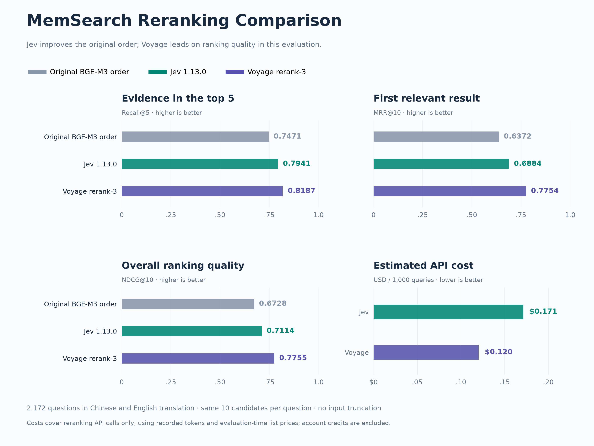

# Reranking evaluation

This experiment compares the original order of frozen retrieval candidates with
Jev and Voyage rerank-3. It measures reranking quality on existing memory data,
not the performance of a complete search-and-answer system. Jev is an optional
provider; this experiment does not change the default search configuration.

## Dataset and fixed candidates

The existing embedding evaluation contains 955 memory chunks and 2,172 queries
in each language, Chinese and English. English is a translation of the same
data. The aggregate therefore covers 4,344 language-query rows, not 4,344
independent questions. Each language contains 955 simple, 926 complex, and 291
multi-hop queries.

These categories come from the original generation pipeline:

- **Simple:** a factual query answerable from one chunk.
- **Complex:** a query requiring interpretation, reasoning, or synthesis, still
  answerable from one chunk. The generator only considered chunks with at least
  150 characters; length is an eligibility rule, not a difficulty measurement.
- **Multi-hop:** a query with multiple positive chunks, generated from related
  notes grouped by project and date.

The labels are generated annotations, not an exhaustive human assessment of
every potentially relevant passage. A passage judged useful by a reranker can
still be absent from the recorded positive IDs. Earlier exploratory subsets
were used to inspect the prompt and API shape; the full dataset is not an
untouched held-out test set.

For every query, the experiment reuses ten candidate IDs and their order from
the historical **Chinese BGE-M3** retrieval run. English evaluation uses the
translations of those exact queries and candidate chunks. We do not regenerate
English embeddings or retrieve new English candidates. This controls candidate
membership across languages, but these results must not be compared directly
with the language-specific retrieval scores in the older embedding table.

Missing positives remain missing: no gold documents are injected into the
candidate pool. Recall@10 is consequently identical for all three methods.
This is also different from normal `MemSearch.search()`, which fetches three
times the requested `top_k` before reranking.

## Models and prompt

- **Baseline:** frozen BGE-M3 candidate order, without additional reranking.
- **Jev:** pinned to `jev-1.13.0`; one request per query, with one independent
  Noul question per candidate. No input truncation or threshold filtering.
- **Voyage:** `rerank-3` (Preview at evaluation time), one request per query,
  `top_k=10`, `truncation=false`, and the original query without added instructions.

The Jev prompt adapts the [official reranking cookbook](https://docs.typesafe.ai/cookbooks/rerank_typesafe)
from legal citation matching to memory retrieval. Unlike the cookbook's
one-request-per-pair implementation, candidate text is placed in each question
and the query is shared in `state`. Questions are independent; this is not
joint listwise ranking. The request builder and exact instructions are in
`src/memsearch/jev_reranker.py`:

```text
Instructions:
The query asks about information recorded in project memory. Could the candidate
passage be a source for the answer — does it state the specific fact, decision,
procedure, or event the query asks about?

True:
The candidate passage states or establishes the specific information needed to
answer the query, or a necessary supporting fact for a query requiring multiple passages.

False:
The candidate passage is merely on a similar topic or project; it does not supply
the specific information the query requires.
```

The prompt is the same for both languages. Candidates are sorted by descending
Noul probability, with original order retained on ties. Every query uses the
same prompt; no query-specific prompt optimization is performed.

## Metrics

Metrics are macro-averaged over query rows. To preserve continuity with the
historical embedding evaluation, this report publishes both definitions:

| Metric | Definition | Historical compatibility |
| --- | --- | --- |
| Hit@K | 1 if any recorded positive is in the first K results, otherwise 0 | Exactly the historical script's metric labeled Recall@K |
| Recall@K | Number of positives in the first K results divided by all recorded positives | Matches Hit@K for single-positive queries; differs for multi-positive queries |
| MRR@10 | Reciprocal rank of the first positive within ten candidates, or zero | Same formula as historical MRR with top-10 retrieval |
| NDCG@10 | Binary relevance, ideal ranking based on all recorded positives | Same formula as the historical script |

For example, retrieving one of three positives in the first five positions gives
Hit@5 = 1 and Recall@5 = 1/3. Neither metric silently replaces the other. The
historical embedding table retains its original values and labels; use the
Hit@K columns in the new JSON/CSV when matching its metric definition.

Matching the metric definition does not remove differences in retrieval setup:
the English reranking rows reuse Chinese candidate IDs, while the old English
embedding benchmark performed English retrieval. Earlier subsets also informed
prompt inspection. These tables should not be combined into a single embedding
leaderboard. The overall table weights each query equally, not each category;
Chinese and English have equal numbers of rows.

## Full results (2026-09-20)

All 4,344 language-query rows completed successfully. Each provider has 2,172 requests per language, one request per query with ten candidates. Cached responses with identical request payloads were reused.

| Language | Method | Queries | Recall@5 | MRR@10 | NDCG@10 | Recall@10 |
| --- | --- | ---: | ---: | ---: | ---: | ---: |
| Overall | Frozen order | 4344 | 0.7471 | 0.6372 | 0.6728 | 0.8350 |
| Overall | Jev 1.13.0 | 4344 | 0.7941 | 0.6884 | 0.7114 | 0.8350 |
| Overall | Voyage rerank-3 | 4344 | 0.8187 | 0.7754 | 0.7755 | 0.8350 |
| Chinese | Frozen order | 2172 | 0.7471 | 0.6372 | 0.6728 | 0.8350 |
| Chinese | Jev 1.13.0 | 2172 | 0.7930 | 0.6885 | 0.7119 | 0.8350 |
| Chinese | Voyage rerank-3 | 2172 | 0.8211 | 0.7766 | 0.7768 | 0.8350 |
| English | Frozen order | 2172 | 0.7471 | 0.6372 | 0.6728 | 0.8350 |
| English | Jev 1.13.0 | 2172 | 0.7952 | 0.6883 | 0.7110 | 0.8350 |
| English | Voyage rerank-3 | 2172 | 0.8164 | 0.7743 | 0.7743 | 0.8350 |

### Historical metric continuity

The following uses the old any-positive hit definition. All Hit@1/5/10 and
Recall@1/5/10 breakdowns are available in the aggregate JSON and CSV.

| Language | Method | Hit@5 (historical Recall@5) | Recall@5 |
| --- | --- | ---: | ---: |
| Overall | Frozen order | 0.7827 | 0.7471 |
| Overall | Jev 1.13.0 | 0.8303 | 0.7941 |
| Overall | Voyage rerank-3 | 0.8531 | 0.8187 |
| Chinese | Frozen order | 0.7827 | 0.7471 |
| Chinese | Jev 1.13.0 | 0.8297 | 0.7930 |
| Chinese | Voyage rerank-3 | 0.8550 | 0.8211 |
| English | Frozen order | 0.7827 | 0.7471 |
| English | Jev 1.13.0 | 0.8310 | 0.7952 |
| English | Voyage rerank-3 | 0.8513 | 0.8164 |

### Visual comparison



The four panels summarize aggregate Recall@5, MRR@10, NDCG@10 and estimated
reranking API cost per 1,000 queries. Jev improves Recall@5 by 4.70 percentage
points over the frozen order, while Voyage adds another 2.46 points and has a
larger advantage in MRR@10 (0.7754 versus 0.6884). In this evaluation, Voyage is
better at moving a labelled positive to the first few positions, not just into
the top five. The recorded usage implies about $0.171 per 1,000 queries for Jev
and $0.120 for Voyage at the evaluation-time prices, before account credits.
These figures cover reranking only, not the complete search pipeline.

The comparison supports Jev as an optional provider, rather than a new default.
It does not establish that Jev is generally weaker at reranking: this run tests
one Noul prompt on generated memory queries and a fixed candidate pool, with
potentially incomplete positive labels. Different relevance criteria or graded
scoring could change the result, but were not validated by this full-set run.

Regenerate the figure from the published aggregates, without API calls:

```bash
uv run evaluation/plot_reranking_comparison.py
```

### Interpretation

Both rerankers improve aggregate Recall@5, MRR@10, and NDCG@10 over the frozen
candidate order. Voyage rerank-3 performs better on all three metrics in both
languages and in every generated query category. Jev's aggregate Chinese and
English MRR values are nearly identical (0.6885 and 0.6883); translating this
benchmark to English does not remove its gap to Voyage. Complex queries show
the largest MRR gap. These observations apply to this dataset, prompt, and
fixed candidate pool, not to all decision or retrieval tasks.

Jev remains an explicit opt-in alternative. The evaluation does not justify
changing the default provider or claiming that Jev is the best reranker for
memory search. The older local-reranker pilot is not included in the full-set
comparison because it covered only 30 queries.

### Results by generated query category

| Language | Category | Queries | Frozen R@5 | Jev R@5 | Voyage R@5 | Frozen MRR@10 | Jev MRR@10 | Voyage MRR@10 |
| --- | --- | ---: | ---: | ---: | ---: | ---: | ---: | ---: |
| Overall | simple | 1910 | 0.7675 | 0.8272 | 0.8398 | 0.6256 | 0.6956 | 0.7606 |
| Overall | complex | 1852 | 0.7657 | 0.8072 | 0.8396 | 0.6217 | 0.6571 | 0.7699 |
| Overall | multi_hop | 582 | 0.6212 | 0.6436 | 0.6831 | 0.7243 | 0.7646 | 0.8419 |
| Chinese | simple | 955 | 0.7675 | 0.8283 | 0.8419 | 0.6256 | 0.6971 | 0.7638 |
| Chinese | complex | 926 | 0.7657 | 0.8035 | 0.8423 | 0.6217 | 0.6578 | 0.7703 |
| Chinese | multi_hop | 291 | 0.6212 | 0.6441 | 0.6854 | 0.7243 | 0.7581 | 0.8391 |
| English | simple | 955 | 0.7675 | 0.8262 | 0.8377 | 0.6256 | 0.6941 | 0.7574 |
| English | complex | 926 | 0.7657 | 0.8110 | 0.8369 | 0.6217 | 0.6564 | 0.7695 |
| English | multi_hop | 291 | 0.6212 | 0.6431 | 0.6808 | 0.7243 | 0.7711 | 0.8447 |

### Token usage and indicative cost

| Language | Provider | Requests | Billable tokens | Estimated USD | Mean request seconds |
| --- | --- | ---: | ---: | ---: | ---: |
| Chinese | Jev 1.13.0 | 2172 | 9,565,342 | $0.4017 | 1.225 |
| English | Jev 1.13.0 | 2172 | 8,156,231 | $0.3426 | 0.863 |
| Chinese | Voyage rerank-3 | 2172 | 5,222,825 | $0.2611 | 0.875 |
| English | Voyage rerank-3 | 2172 | 5,228,292 | $0.2614 | 0.603 |

Estimates use $0.042 per million Jev input tokens and $0.05 per million Voyage rerank-3 tokens, before account credits. These are estimated costs for all logical requests, including reused responses, not an account invoice. Failed requests without usage metadata are not included. Provider tokenizers and accounting differ. Sources: [TypeSafe pricing](https://typesafe.ai/blog/introducing-system-one-models-and-jev), [Voyage pricing](https://docs.voyageai.com/docs/pricing).

Latency includes network overhead, concurrent traffic (eight workers), and recorded retry time. Reused subset responses were collected with twelve workers. Treat these numbers as observations from this run, not a controlled throughput or model-only speed benchmark.

Full-precision metrics, input hashes, and the request template are in [reranking-results.json](https://github.com/zilliztech/memsearch/blob/main/evaluation/reranking-results.json); all language/category/metric combinations are also in [reranking-metrics.csv](https://github.com/zilliztech/memsearch/blob/main/evaluation/reranking-metrics.csv).


## Reproduce on an authorized dataset copy

The original memory corpus and per-query outputs are private and are not
included in this repository. Aggregate metrics and input hashes are published;
an authorized copy of the inputs is required to reproduce these exact numbers.
The runner also accepts another dataset following the same schema.

From the repository root:

```bash
uv sync --locked
export TYPESAFE_API_KEY="your-key"
export VOYAGE_API_KEY="your-key"
uv run python evaluation/rerank_evaluate.py \
  --data-dir /path/to/data \
  --candidates /path/to/details_local_BAAI_bge-m3_zh.json \
  --output /path/to/private-results \
  --workers 8
```

Use `--preflight` to validate inputs and print a conservative byte-based cost
estimate without making API calls. Required inputs are:

| File | Format |
| --- | --- |
| `corpus_zh.jsonl`, `corpus_en.jsonl` | One object per line with `chunk_id` and `content` |
| `queries_zh.jsonl`, `queries_en.jsonl` | One object per line with `query_id`, `query`, `query_type`, and nonempty `positive_chunk_ids` |
| Candidate JSON | An array of objects with `query_id` and exactly ten unique `retrieved_ids` |

The languages must have matching query IDs and positive references. The same
candidate file is used for both languages. The runner checks coverage and saves
input SHA-256 hashes, the prompt, model names, and candidate policy in its
manifest. Each response is cached by the hash of the full request payload.
Rerunning resumes from validated cached responses; `--reuse-cache` can import
compatible responses from an earlier run. Keep all cache directories private.

Transient HTTP 429 and selected 5xx responses receive bounded retries. Failed
requests are recorded separately, and aggregate results are not emitted until
every request succeeds. There is no fallback to the baseline ranking. Output
files include `report.json`, `metrics.csv`, and private per-query details.

## Enable the optional Jev provider

```bash
export TYPESAFE_API_KEY="your-key"
memsearch config set reranker.model jev:jev-1.13.0
```

Use trusted global configuration, not project-local configuration. Queries and
candidate contents are sent to TypeSafe. See [configuration](../docs/home/configuration.md#optional-remote-reranking)
and the [Python API](../docs/python-api.md#optional-jev-reranking) for details.
